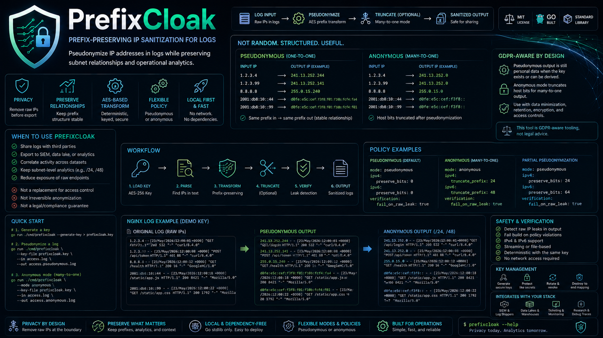

# PrefixCloak

**Prefix-preserving IP sanitization for logs, built for privacy-aware security and data pipelines.**

PrefixCloak is a local-first CLI for sanitizing IP addresses in logs before they leave a trusted boundary. It rewrites IPv4 and IPv6 addresses with an AES-based prefix-preserving transform, then can optionally truncate host bits for many-to-one anonymous output.

<p>
  
</p>

The point is not to make random fake IPs. The point is to keep operational analytics useful while removing raw endpoints from log streams, exports, tickets, data lake jobs, and external handoffs.


## When to Use This

Use PrefixCloak when you need to share or process logs without exposing raw client, server, VPN, firewall, CDN, proxy, or application endpoint IPs.

Good fits:

- sending nginx/apache/VPN/firewall logs to a contractor
- exporting production logs into a lower-trust analytics environment
- loading sanitized logs into a SIEM, warehouse, or data lake
- publishing research traces or reproducible debugging samples
- correlating activity across multiple datasets without keeping raw endpoints in every copy
- keeping subnet-level analytics such as `/24`, `/48`, abuse clusters, ASN enrichment, and coarse geo grouping

Bad fits:

- treating pseudonymized logs as non-personal data without a legal review
- irreversible anonymization without truncation and key destruction
- high-assurance parsing of every possible binary/network format; this first version is line-oriented text
- replacing access control, retention, encryption, or data minimization policy

## What It Preserves

PrefixCloak keeps prefix relationships stable. If two input addresses share a prefix, their pseudonymous outputs share the same prefix length.

Example with a fixed demo key:

```text
1.2.3.4    -> 241.13.252.244
1.2.3.99   -> 241.13.252.141
8.8.8.8    -> 255.0.15.240
```

`1.2.3.4` and `1.2.3.99` are both in `1.2.3.0/24`; their outputs are both in `241.13.252.0/24`. That means analysts can still aggregate by pseudonymous subnet without seeing the original subnet.

In anonymous mode, host bits are truncated after pseudonymization:

```text
1.2.3.4    -> 241.13.252.0
1.2.3.99   -> 241.13.252.0
8.8.8.8    -> 255.0.15.0
```

Now the first two records collapse to the same `/24`, which is many-to-one.

## GDPR and Legal Honesty

PrefixCloak deliberately uses explicit labels:

- `pseudonymous`: one-to-one, key-dependent, stable across files when the same key is used
- `anonymous`: pseudonymization plus truncation, intended for many-to-one output

Pseudonymous output should still be treated as personal data under GDPR when the key or equivalent mapping capability exists. Anonymous output is only defensible if the policy actually collapses records enough for the dataset and the key is not retained.

This project is GDPR-aware tooling, not legal advice and not a compliance guarantee.

## Install

Build locally:

```sh
go build ./cmd/prefixcloak
```

Run without installing:

```sh
go run ./cmd/prefixcloak --help
```

The project currently uses only the Go standard library.

## Quick Start

Generate a key:

```sh
go run ./cmd/prefixcloak --generate-key > prefixcloak.key
```

Pseudonymize a log:

```sh
go run ./cmd/prefixcloak \
  --key-file prefixcloak.key \
  --in access.log \
  --out access.pseudonymous.log
```

Stream through a pipeline:

```sh
tail -f /var/log/nginx/access.log | \
  prefixcloak --key-file /etc/prefixcloak/prod.key | \
  vector
```

Use anonymous mode:

```sh
go run ./cmd/prefixcloak \
  --mode anonymous \
  --key-file prefixcloak.key \
  --in access.log \
  --out access.anonymous.log
```

Anonymous mode defaults to IPv4 `/24` and IPv6 `/48` truncation if no policy overrides are provided.

## Policy

Policies are small YAML-like files with supported PrefixCloak fields.

Pseudonymous policy:

```yaml
mode: pseudonymous
ipv4:
  preserve_bits: 0
ipv6:
  preserve_bits: 0
verification:
  fail_on_raw_leak: true
```

Anonymous policy:

```yaml
mode: anonymous
ipv4:
  truncate_prefix: 24
ipv6:
  truncate_prefix: 48
verification:
  fail_on_raw_leak: true
```

Partial pseudonymization, useful for host-only style masking:

```yaml
mode: pseudonymous
ipv4:
  preserve_bits: 24
ipv6:
  preserve_bits: 64
verification:
  fail_on_raw_leak: true
```

With `preserve_bits`, the leading network bits remain raw and only the remaining bits are pseudonymized. Use this only when preserving the original network allocation is intentional.

## Examples

The `examples/` directory contains a reproducible nginx sample.

Input: [examples/nginx.log](examples/nginx.log)

```text
1.2.3.4 - - [23/May/2026:12:00:01 +0000] "GET /api/login HTTP/1.1" 200 532 "-" "curl/8.4.0"
1.2.3.99 - - [23/May/2026:12:00:08 +0000] "POST /api/token HTTP/1.1" 401 88 "-" "curl/8.4.0"
8.8.8.8 - - [23/May/2026:12:00:12 +0000] "GET /health HTTP/1.1" 200 16 "-" "GoogleHC/1.0"
2001:db8:10::44 - - [23/May/2026:12:00:18 +0000] "GET /static/app.js HTTP/1.1" 200 8421 "-" "Mozilla/5.0"
2001:db8:10::99 - - [23/May/2026:12:00:22 +0000] "GET /static/app.css HTTP/1.1" 200 1792 "-" "Mozilla/5.0"
```

Run pseudonymous mode:

```sh
go run ./cmd/prefixcloak \
  --report=false \
  --key-file examples/demo.key \
  --policy examples/pseudonymous.policy.yml \
  --in examples/nginx.log
```

Output: [examples/pseudonymous.out.log](examples/pseudonymous.out.log)

```text
241.13.252.244 - - [23/May/2026:12:00:01 +0000] "GET /api/login HTTP/1.1" 200 532 "-" "curl/8.4.0"
241.13.252.141 - - [23/May/2026:12:00:08 +0000] "POST /api/token HTTP/1.1" 401 88 "-" "curl/8.4.0"
255.0.15.240 - - [23/May/2026:12:00:12 +0000] "GET /health HTTP/1.1" 200 16 "-" "GoogleHC/1.0"
d0fe:e5c:cef:f3f8:f01:f10b:fcf4:fa4 - - [23/May/2026:12:00:18 +0000] "GET /static/app.js HTTP/1.1" 200 8421 "-" "Mozilla/5.0"
d0fe:e5c:cef:f3f8:f01:f10b:fcf4:f01 - - [23/May/2026:12:00:22 +0000] "GET /static/app.css HTTP/1.1" 200 1792 "-" "Mozilla/5.0"
```

Run anonymous mode:

```sh
go run ./cmd/prefixcloak \
  --report=false \
  --key-file examples/demo.key \
  --policy examples/anonymous.policy.yml \
  --in examples/nginx.log
```

Output: [examples/anonymous.out.log](examples/anonymous.out.log)

```text
241.13.252.0 - - [23/May/2026:12:00:01 +0000] "GET /api/login HTTP/1.1" 200 532 "-" "curl/8.4.0"
241.13.252.0 - - [23/May/2026:12:00:08 +0000] "POST /api/token HTTP/1.1" 401 88 "-" "curl/8.4.0"
255.0.15.0 - - [23/May/2026:12:00:12 +0000] "GET /health HTTP/1.1" 200 16 "-" "GoogleHC/1.0"
d0fe:e5c:cef:: - - [23/May/2026:12:00:18 +0000] "GET /static/app.js HTTP/1.1" 200 8421 "-" "Mozilla/5.0"
d0fe:e5c:cef:: - - [23/May/2026:12:00:22 +0000] "GET /static/app.css HTTP/1.1" 200 1792 "-" "Mozilla/5.0"
```

Notice that `1.2.3.4` and `1.2.3.99` collapse to one pseudonymous `/24`, while the two IPv6 addresses collapse to one pseudonymous `/48`.

## CLI

```text
Usage of prefixcloak:
  -generate-key
        generate a new PrefixCloak key and print it
  -in string
        input file; defaults to stdin
  -key-base64 string
        PrefixCloak key as base64
  -key-file string
        file containing key as hex, base64, hex:<value>, or base64:<value>
  -key-hex string
        PrefixCloak key as hex
  -mode string
        override mode: pseudonymous or anonymous
  -out string
        output file; defaults to stdout
  -policy string
        YAML policy file
  -report
        print a GDPR-aware processing report to stderr (default true)
```

## Key Handling

PrefixCloak keys are 32 bytes. Store them separately from sanitized data.

For pseudonymous analytics:

- keep the key in a controlled secret store
- rotate keys by dataset or retention window
- document which key produced which exported dataset
- treat output as personal data while the key exists

For anonymous exports:

- use a job-specific key
- apply explicit truncation
- verify the output
- discard the key material
- keep only the truncated output

## Verification

`fail_on_raw_leak` rejects a line if an IP parsed from the input is still present after transformation. This catches common policy mistakes such as preserving all IPv4 bits.

It is a guardrail, not a formal proof. Encoded, malformed, split, binary, or application-specific endpoint fields may need dedicated adapters.

## Current Scope

Implemented:

- IPv4 and IPv6 prefix-preserving pseudonymization
- anonymous truncation mode
- partial prefix preservation
- streaming line-oriented text replacement
- nginx/apache-style logs, JSONL, CSV, and similar text records
- local key generation/loading
- GDPR-aware processing report
- no external Go dependencies

Planned:

- schema-aware CSV and JSONL adapters
- pcap adapter
- NetFlow/IPFIX adapter
- Parquet adapter
- stronger raw-endpoint verification reports
- benchmarks for high-volume pipelines

## License

MIT. See [LICENSE](LICENSE).
